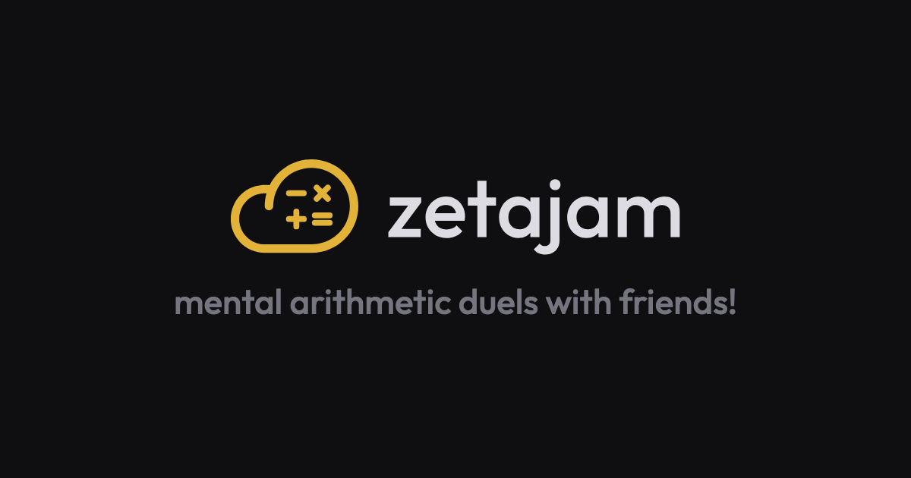

<div align="center">

<a href="https://zetajam.vercel.app">
  
</a>

<p>
  <a href="https://zetajam.vercel.app"><strong>Play&nbsp;»</strong></a>
  &nbsp;·&nbsp;
  <a href="#how-it-works"><strong>How it works</strong></a>
  &nbsp;·&nbsp;
  <a href="https://github.com/Tchanwangsa/zetajam/issues/new"><strong>Report a bug</strong></a>
</p>

<p>
  <a href="https://github.com/Tchanwangsa/zetajam/actions/workflows/ci.yml"></a>&nbsp;
  <a href="https://go.dev/"></a>&nbsp;
  <a href="https://svelte.dev/"></a>&nbsp;
  <a href="https://www.typescriptlang.org/"></a>&nbsp;
  <a href="https://vite.dev/"></a>&nbsp;
  <a href="https://github.com/gorilla/websocket"></a>&nbsp;
  <a href="https://www.docker.com/"></a>&nbsp;
  <a href="https://cloud.google.com/run"></a>&nbsp;
  <a href="https://vercel.com/"></a>
</p>

</div>

## About

Mental arithmetic, head to head. A Go websocket server and a Svelte frontend
that build into one static binary.

- **Solo runs** against the clock, or **rooms** of up to eight — public and
  listed, or private behind a four-character code.
- **Classic, ramp or rush** — fixed difficulty; a run that opens easy and
  climbs a step every two questions, thirty levels of it; or one question in
  front of everybody at once, five seconds each, first correct answer taking
  the point.
- Configurable operations, term ranges and length; a live graph of everybody's
  pace, with a per-question breakdown of your own.

## Run it

```bash
make server                # Go on :8080
cd web && pnpm dev         # Vite on :5173, proxies /ws to :8080
```

`make watch` runs the server under [air](https://github.com/air-verse/air)
instead, rebuilding whenever a `.go` file changes. Worth knowing what that
costs: matches and rooms live in the process's memory, so every rebuild takes
the open ones with it — the page reconnects on its own but does not re-join,
so testing a server change mid-match means reloading and joining again.

`make build` produces `bin/zetajam` — the frontend embedded in the binary, no
runtime dependencies. `make check` runs the parity diff, `go vet` and
`svelte-check`.

## How it works

**Questions are a pure function, not a stream.** `question(seed, i, cfg)`
derives question `i` from the seed alone. The server sends one seed and one
config at match start and never sends a question: every client generates the
same stream locally at zero latency, and the server can verify answer `i`
without replaying the ones before it.

**One frame per correct answer**, about 40 bytes:

```json
{"t":"answer","i":17,"v":74,"ms":9421}
```

Not one per keystroke. A two-minute match is a couple of kilobytes uplink, and
a room of eight costs the server eight relays rather than sixty-four a second.

**The server decides the score.** The client checks your answer locally so
typing feels instant, but it does not report its own score — the server
re-derives the expected answer for every frame and counts only the ones that
match, in order. Answers arriving closer than 120ms apart are flagged.

**Rush is the same machinery with one rule added.** A slot is a question index
laid on the match clock. What the server adds is a ledger: the first valid buzz
for a slot takes it and every later one is refused, so a question is worth
exactly one point, to one player, or to nobody. "First" means first to arrive —
the timestamp on the frame is the client's own, and a race decided on it would
be a race to lie about it. Which is why rush is the one mode where a client
cannot score itself: it answers and waits for the `claim` frame to say who won.

**A taken question ends there.** Five seconds is what a slot gets if nobody
gets it; a claim closes it half a second later and the next one opens, so the
room never sits watching a question somebody has already won. That makes the
schedule a fold over the run rather than a division of the clock — but still
one nobody has to be told: the `claim` frame already carries the slot and the
millisecond it landed on, so every screen folds the same history into the same
boundaries and turns over together, and the server folds it too so a buzz is
judged against the window the player was looking at.

**The generator exists twice** — `internal/quiz/` in Go, `web/src/lib/` in
TypeScript — and the two must agree bit for bit. `make parity` diffs 500
questions across both under four configs and fails if they diverge — and pins
rush to the same stream classic draws under the same ranges, because rush
changes the rules and not the numbers. Change one, change the other.

**Settings travel with the join.** The server normalizes the config once
(canonical operation order, no inverted range, 10s–600s) and echoes the
normalized copy back; every client generates from that copy, not its own, so no
two sides can disagree even if one is lying. Subtraction and division are
generated as inverted addition and multiplication, which is what keeps every
answer a clean positive integer — and why only two of the four operations have
a range worth setting.

**The graph plots cumulative answers**, sampled on a fixed 1Hz clock rather
than on network events, over a fixed `0..duration` x domain. A running total is
monotonic, so the axis only ever grows and the line cannot snap back while
somebody else is typing.

## Layout

```
internal/quiz/          question generator + config (Go side of the mirror)
server/                 websocket hub, matchmaking, rooms, verification, static serving
web/src/lib/            rng, questions + config (TS side of the mirror), net, graph maths
web/src/components/     screens; ui/ is the parts used in more than one of them
web/src/app.css         tokens and the shared button/field/surface classes
cmd/parity/             prints a question stream for the parity diff
```

## Deploy

Websockets are long-lived and matches live in one process's memory, so this
needs a host that holds connections open and runs a **single instance** — a
second instance puts two players on different machines where they never see
each other.

Cloud Run is one such host, and `make deploy` wraps it:

```bash
make deploy SERVICE=your-service REGION=your-region
```

The flags that matter are `--min-instances 1 --max-instances 1` (one warm
process) and `--timeout 3600` (the default five minutes would cut a websocket
off mid-match). Anything comparable works — a VM, Fly, Render, a container
anywhere. API-Gateway-style websockets do not, without moving the hub into a
database first.

The health endpoint is `/health`.

### Frontend on a separate host

Optional. Build the page against the deployed server and host it anywhere
static:

```bash
cd web && VITE_WS_URL=https://your-server pnpm build:static
```

Then set `ORIGINS` on the server to the page's origin — a websocket upgrade
from another origin is not covered by CORS, so the server checks `Origin`
itself. Same-origin and localhost are always allowed. `web/vercel.json` and
`web/public/_redirects` carry the rewrite that keeps `/r/CODE` links from
404ing.

`VITE_SITE_URL` is the page's own public address, and it is a different thing
from `VITE_WS_URL`: the canonical link, the Open Graph and Twitter tags, the
JSON-LD, `robots.txt` and `sitemap.xml` are all built from it, and all of them
need an absolute URL because the crawler reading them is never on this origin.
`web/vite.config.ts` substitutes it into `index.html` and writes the two
crawler files, so there is one hostname to change rather than five. It has a
default; set it when the page ships somewhere else.

### CI

`.github/workflows/ci.yml` runs the checks on every push and pull request, and
on `main`/`master` deploys the server and then the page — in that order, since
an old page against a new server is survivable and the reverse is not. The
deploy jobs need host credentials as repository secrets and variables — the
comments in the workflow say which, and the jobs are the first thing to drop if
you would rather deploy by hand.
